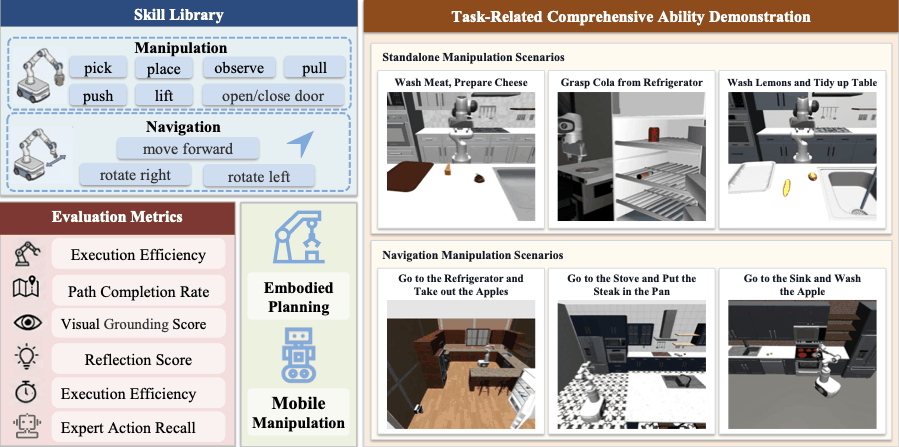

# RMMBench

<div align="center">

[**Project Page**](https://mxxq-stack.github.io/rmmbench-project/) &nbsp;|&nbsp; [**Paper**]()

<!-- TODO: fill in the real links above -->



</div>

RMMBench is a benchmark framework for robotic Mobile Manipulation, built on the `dm_control` / MuJoCo simulation environment. It supports robotic arm skill execution, scene-level task orchestration, and closed-loop evaluation with Vision-Language Models (VLMs).

## Requirements

- Python 3.10
- conda (recommended, for isolating simulation-related dependencies)

## Installation

```bash
# 1. Create the environment
conda create -n rmmbench python=3.10 -y
conda activate rmmbench

# 2. Install dependencies (for GPU-enabled torch, install the matching CUDA version via the official index)
pip install -r requirements.txt

# 3. Install RMMBench in editable mode
pip install -e .

```

## Install GraspNet

> Run all commands below from the RMMBench root directory.

Install graspnet-baseline and its dependencies:

```bash
git clone https://github.com/graspnet/graspnet-baseline.git
cd graspnet-baseline

pip install -r requirements.txt

cd pointnet2
python setup.py install

cd knn
python setup.py install

cd ../..
```

Install graspnetAPI:

```bash
git clone https://github.com/graspnet/graspnetAPI.git
cd graspnetAPI
pip install .
cd ..
```

Download the weights and place them at `RMMBench/graspnet_baseline/logs/log_rs/checkpoint-rs.tar`:

```bash
mkdir -p graspnet_baseline/logs/log_rs
# Put the downloaded checkpoint-rs.tar into this directory
```

## Download Assets

> Download simulation scene assets from HuggingFace and extract them into `RMMBench/assets`

Return to the root directory and run:

```bash
cd ..
bash download_assets.sh
```

## Run VLM Evaluation

Run the evaluation script from the repo root:

```bash
bash run_vlm_eval.sh
```

Before running, edit the config variables at the top of `run_vlm_eval.sh`. Leave a variable empty to use the default from `scripts/vlm_eval.py`; switches accept `"1"` to enable, `"0"` or empty to disable.

| Variable | Description |
| --- | --- |
| `SAVE_DIR` | Directory to save evaluation results |
| `VLM_URL` | VLM server URL |
| `API_KEY` | API key for the VLM service |
| `HISTORY_MAXLEN` | Max history length kept in the VLM conversation |
| `MAX_SKILLS_NUM` | Max number of skills per episode |
| `NUM_WORKERS` | Number of parallel workers (`1` = serial, `>1` = multiprocessing pool) |
| `USE_GRASPNET` | Set to `"1"` to enable grasp detection with GraspNet |
| `SAVE_VIDEO` | Set to `"1"` to save episode videos |

To test navigation tasks, change the default of `--episode-config` in `scripts/vlm_eval.py` from `manipulation_episodes.json` to `nav_episodes.json` (both under `RMMBench/vlm_evaluation/configs/episodes/`).

## Known Limitations

- The navigation tasks are still under optimization: the expert skill sequences and navigation paths of the 20 newly added navigation tasks are being refined and will be finalized before the official release.
- Some scripts still contain debug prints and experimental code left from development; they do not affect normal usage and will be cleaned up in the final version.
- Results for more VLM backends and ablation studies are still in progress and have not been included in this repository yet.
